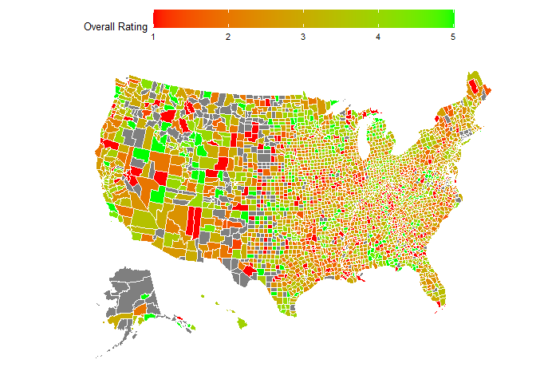
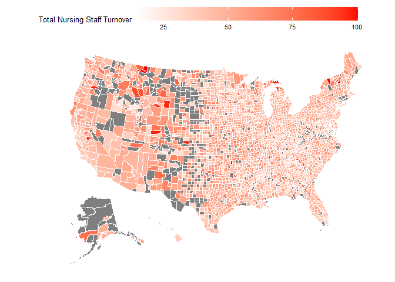
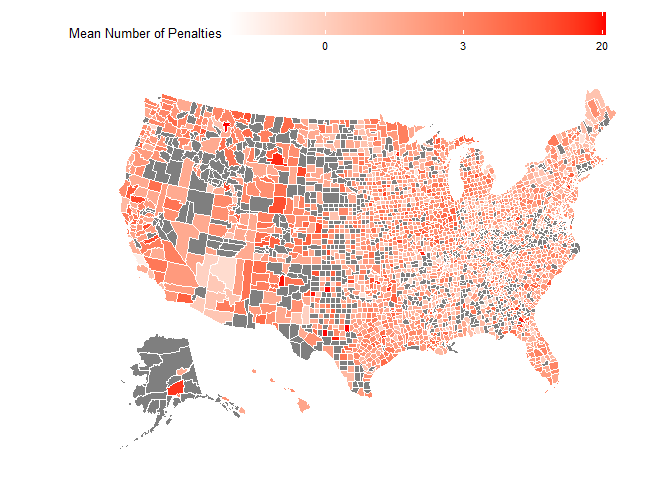

Nursing Home Case Study
================
Zhouming Sun
2025-05-17

  

## Abstract

Nursing plays a critical role in long term care. This case study is an
investigation into nurse staffing data available at
<https://data.cms.gov/quality-of-care/payroll-based-journal-daily-nurse-staffing>
and <https://data.cms.gov/provider-data/topics/nursing-homes> in order
to draw a correlation between nurse staffing metrics and overall quality
of care that impacts patients. In brief, when the daily mean nurse hours
are above 4 per resident, facilities are given higher ratings and
receive fewer penalties.

## Correlations and Plots

First, a quick look into the *NH_ProviderInfo_Nov2024.csv* file reveals
correlations about the providers and various measures of their quality.
The easiest measure to compare against is each provider’s Overall
Rating, on a scale of 1-5, with 1 being the lowest score.

``` r
providers <- read.csv(r"(C:\Users\pokem\Downloads\nursing_homes_including_rehab_services_current_data\NH_ProviderInfo_Nov2024.csv)")

aggregate(Total.nursing.staff.turnover ~ Overall.Rating, data=providers, FUN = mean) %>% plot(main = "Overall Rating ~ Mean Total Nursing Staff Turnover")
```

<!-- -->

This demonstrates that high nursing staff turnover is correlated with a
poor overall rating. If one is focused on contractor staffing data,
which is not available in the *NH_ProviderInfo_Nov2024.csv* file, total
nursing staff turnover will have to do as a proxy measurement.

The following graphs show several other correlations.

``` r
aggregate(Number.of.administrators.who.have.left.the.nursing.home ~ Overall.Rating, data=providers, FUN = mean) %>% plot(main = "Overall Rating ~ Mean Number of departed administrators")
```

<!-- -->

``` r
aggregate(Number.of.Facility.Reported.Incidents ~ Overall.Rating, data=providers, FUN = mean) %>% plot(main = "Overall Rating ~ Mean Number of Facility Reported Incidents")
```

<!-- -->

``` r
aggregate(Number.of.Substantiated.Complaints ~ Overall.Rating, data=providers, FUN = mean) %>% plot(main = "Overall Rating ~ Mean Number of Substantiated Complaints")
```

<!-- -->

``` r
aggregate(Total.Number.of.Penalties ~ Overall.Rating, data=providers, FUN = mean) %>% plot(main = "Overall Rating ~ Mean Number of Penalties")
```

<!-- -->

``` r
aggregate(Number.of.Payment.Denials ~ Overall.Rating, data=providers, FUN = sum) %>% plot(main = "Overall Rating ~ Total Number of Payment Denials", sub="Note: Payment denials are from Medicaid or Medicare" )
```

<!-- -->

``` r
aggregate(Reported.Total.Nurse.Staffing.Hours.per.Resident.per.Day ~ Overall.Rating, data=providers, FUN = mean) %>% plot(
  main = "Overall Rating ~ Nurse Hours Per Resident",
  ylab = "Daily Mean Nurse Hours per Resident", 
  yaxp = c(3,5,8)
)
```

<!-- -->

From these graphs, it is clear that Overall Rating is negatively
correlated with ‘general indicators of poor quality’, being in this
case: staff turnover, administrator turnover, reported facility
incidents, substantiated complaints, penalties, and payment denials from
Medicaid or Medicare.

These poorly rated facilities deserve critical examination. They are
delivering an overall worse quality of care, and resulting in high staff
turnover.

The last graph demonstrates a correlation between mean nurse hours per
resident and overall rating. Facilities that are struggling with low
rating and quality would be well advised add more staff such that the
Daily Mean Nurse Hours are above 4 per resident.

## Facility Ownership

Being aware of poorly managed and rated facilities is a good start, but
the *NH_Ownership_Nov2024.csv* file can be utilized to identify the
owners responsible for the penalties. The following code connects each
facility’s penalties to the owners at the time. This is to not count
cases for owners if their association date comes after the penalty date.
In other words, if you just joined a facility, you are not responsible
for the facility’s past penalties. If a penalty occurs after you become
an owner, it is counted against you.

``` r
ownership <- read.csv(r"(C:\Users\pokem\Downloads\nursing_homes_including_rehab_services_current_data\NH_Ownership_Nov2024.csv)")
penalties <- read.csv(r"(C:\Users\pokem\Downloads\nursing_homes_including_rehab_services_current_data\NH_Penalties_Nov2024.csv)")

ownership$DATE <- sapply(strsplit(ownership$Association.Date, split = " ", fixed = TRUE), function(x)(x[2])) %>% as.Date("%m/%d/%Y")

for (i in 1:nrow(penalties)) {
  owners <- ownership[which(ownership$DATE < penalties$Penalty.Date[i] & 
                              ownership$CMS.Certification.Number..CCN. == penalties$CMS.Certification.Number..CCN.[i]) , 
                      c("Owner.Name", "CMS.Certification.Number..CCN.", "DATE")]
  
  owners <- owners[! duplicated(owners$Owner.Name), ] # remove duplicate owners for a single penalty
  
  if (i == 1) {
    penalized_owners_with_date <- owners
  } else{
    penalized_owners_with_date <- bind_rows(penalized_owners_with_date, owners)
  }
}

count_owner_penalty_with_date <- count(penalized_owners_with_date, Owner.Name)

summary(count_owner_penalty_with_date)
```

    ##   Owner.Name              n         
    ##  Length:25968       Min.   :  1.00  
    ##  Class :character   1st Qu.:  1.00  
    ##  Mode  :character   Median :  2.00  
    ##                     Mean   :  6.44  
    ##                     3rd Qu.:  5.00  
    ##                     Max.   :393.00

This summary shows most penalized owners keep it to 5 or fewer
penalties. Then there is a special subset of the bunch who are
responsible for the vast majority of penalties. Let’s take a look at the
top 50 offenders.

``` r
head(count_owner_penalty_with_date[order(-count_owner_penalty_with_date$n), ] , 50)
```

    ##                                                  Owner.Name   n
    ## 12920                                       LAHASKY, EPHRAM 393
    ## 13000                                       LANDA, BENJAMIN 279
    ## 8226                                 GEN OPERATIONS II, LLC 277
    ## 8225                                  GEN OPERATIONS I, LLC 276
    ## 8237                                 GENESIS HEALTHCARE LLC 276
    ## 9772                           HCCF MANAGEMENT GROUP XI LLC 276
    ## 8235                                 GENESIS HEALTHCARE INC 274
    ## 25806                                 ZAC PROPERTIES XI LLC 274
    ## 22677                            SUN HEALTHCARE GROUP, INC. 273
    ## 1899                                          BERG, MICHAEL 269
    ## 7112                       FC-GEN OPERATIONS INVESTMENT LLC 248
    ## 25039                                       WHITMAN, ARNOLD 242
    ## 7359                                        FISHMAN, STEVEN 240
    ## 16096                                         MORRIS, DIANE 237
    ## 3235                                           BURNAM, SOON 231
    ## 22686                    SUNDANCE REHABILITATION HOLDCO INC 223
    ## 18027                                        PETERSEN, MARK 222
    ## 22340                                            STERN, SAM 211
    ## 1594                           BEACON HEALTH MANAGEMENT LLC 210
    ## 24860                                       WERTHEIM, BRUCE 210
    ## 19003                                      RECHNITZ, SHLOMO 208
    ## 8239                                   GENESIS HOLDINGS LLC 205
    ## 13620                    LIFE CARE CENTERS OF AMERICA, INC. 194
    ## 15487                                        MEYSTEL, YOSEF 193
    ## 1937                                       BERKOWITZ, DAVID 187
    ## 943                                    ATIED ASSOCIATES LLC 184
    ## 2245                                        BLISKO, MICHAEL 184
    ## 5196                                           CROSS, CINDY 183
    ## 8789                        GPN FAMILY TRUST U/A/D 04/28/08 181
    ## 18544                                      PRESTON, FORREST 180
    ## 23364                                        THURMOND, JOAN 177
    ## 7790                                         FREUND, NOCHUM 176
    ## 6184                    DOROS GENERATION TRUST U/A/D 1/3/12 175
    ## 8732                                        GORELICK, BATYA 175
    ## 21028                                      SHABAT, MENACHEM 174
    ## 9113                  GUBIN ENTERPRISES LIMITED PARTNERSHIP 173
    ## 10117                                       HERZKA, YISROEL 166
    ## 14286                                            MAK, DAVID 164
    ## 22440                                       STOLTZ, CHARLES 164
    ## 25732 YOSEF MEYSTEL DECLARATION OF TR OF YOSEF MEYSTEL TTEE 160
    ## 18715                                        QAZI, MOHAMMAD 159
    ## 14178                               MAD FAMILY HOLDINGS LLC 149
    ## 2194                                            BLAKE, GARY 148
    ## 16501                                            NATR TRUST 148
    ## 18899                                   RARMNA HOLDINGS LLC 148
    ## 18926                                            RATR TRUST 148
    ## 19518                                      RNR HOLDINGS LLC 148
    ## 24938                                            WETR TRUST 148
    ## 14451                                      MARGULIES, ZISHA 147
    ## 2197                                          BLAKE, MALISA 146

This list can be used as a blacklist of sorts. It would be advisable to
avoid facilities that are associated with any of these owners, as they
have a history of collecting penalties, which is negatively correlated
with Overall Rating, Staff Turnover, and therefore quality of care.

A case can be made for giving repeat offenders increasingly larger
penalties, as the current punishment structure does not seem to deter
the most penalized owners from continuing their poor management.

## Maps using FIPS Codes

By joining the `providers` file with the `daily_nurse_staffing`
dataframe, we can combine the county and state FIPS codes for mapping
purposes. The inner join conveniently selects only for providers with
data in the 2024 Q2 timeframe of `daily_nurse_staffing`.

``` r
daily_nurse_staffing <- read.csv(r"(C:\Users\pokem\Downloads\PBJ_Daily_Nurse_Staffing_Q2_2024\PBJ_Daily_Nurse_Staffing_Q2_2024.csv)")

providers <- inner_join(providers, daily_nurse_staffing[!duplicated(daily_nurse_staffing$PROVNUM), c("PROVNUM", "COUNTY_FIPS")], by = c("CMS.Certification.Number..CCN." = "PROVNUM"))
providers <- relocate(providers, COUNTY_FIPS, .after = State)

providers$COUNTY_FIPS <- as.character(providers$COUNTY_FIPS)
providers$COUNTY_FIPS <- str_pad(providers$COUNTY_FIPS, 3, pad = "0") # county FIPS codes should be 3 digits long, and can begin with a 0

providers$STATE_FIPS <- usmap::fips(state = providers$State)
providers <- relocate(providers, STATE_FIPS, .after = State)

providers$fips <- paste0(providers$STATE_FIPS, providers$COUNTY_FIPS)
providers <- relocate(providers, fips, .after = State)


df_rating <- aggregate(Overall.Rating ~ fips, data = providers, FUN = mean)
plot_usmap(
  color = "white", 
  linewidth = 0.1, 
  regions = "counties", 
  data = df_rating, 
  values = "Overall.Rating"
) + 
  scale_fill_gradient(
    labels = scales::label_number(accuracy = 1), 
    high = "green", 
    low = 'red'
  ) + 
  theme(
    legend.position = 'top'  , 
    text = element_text(size = 10)
  ) +
  labs(fill = "Overall Rating") + 
  guides(fill = guide_colorbar(
    barwidth = unit(10, 'cm')
  )
  )
```

<!-- -->

It would be worth an investigation into why some counties are associated
with lower rated facilities, and vice versa.

<!-- --><!-- -->

Further investigation into counties with high Total Nursing Staff
Turnover and Mean Number of Penalties might be fruitful. These maps
demonstrate that there are hotspot regions, and the problematic
facilities are not evenly spread throughout the United States.

## Conclusions

If possible, avoid doing business with known penalty-collecting owners
and facilities. Facilities that seek to improve their quality of care
would do well to add more nurses/staff such that the mean nurse staffing
hours per resident per day is greater than 4.

Further investigation into improving the worst-performing facilities
might result in improved patient care and staff turnover rates.
